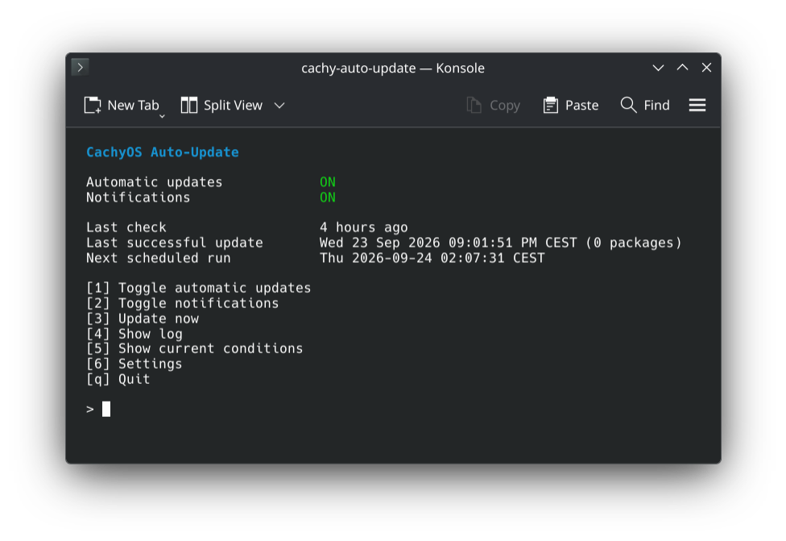

<p align="center">
  
</p>

<h1 align="center">cachy-auto-update</h1>

<h3 align="center">Unattended background updates for CachyOS.</h3>

<p align="center">
  pacman, AUR, Flatpak and AppImages. In the background, with no password prompt.
</p>

<h5 align="center">
  <a href="#install">Install</a> |
  <a href="#how-to-use">How to use</a> |
  <a href="https://github.com/LoonixTools/cachy-auto-update/issues">Report a bug</a>
</h5>

<p align="center">
  <a href="https://ko-fi.com/felitendo"></a>
</p>

## Install

```bash
paru -S cachy-auto-update
sudo cachy-auto-update enable
```

## How to use

```bash
sudo cachy-auto-update
```

<p align="center">
  
</p>

Press **1** to turn automatic updates on or off. **6** has all the settings.

## When does it update?

| | |
|---|---|
| Battery below 30 % | ⏸️ Waits (on power it runs) |
| A game is running | ⏸️ Waits |
| pacman, yay or paru is running | ⏸️ Waits |
| Shutdown or suspend during an update | 🚫 Blocked until it is done |
| Restart after an update | ❌ Never on its own, you get a notification |

## More

<details>
<summary>What it updates</summary>

| | |
|---|---|
| Packages | `pacman -Syu` |
| AUR | `paru` or `yay` |
| Flatpak | system and user installs |
| AppImages | through [Gear Lever](https://github.com/mijorus/gearlever) |

</details>

<details>
<summary>Safety</summary>

- A progress bar shows the step and the package.
- On Btrfs with snapper (the CachyOS default) every update gets a snapshot before and after.
- A lock file left by a power cut is removed on the next run.
- Package replacements are handled on their own. File conflicts are never overwritten.
- A signature error refreshes the keyring once and tries again.

</details>

<details>
<summary>Logs</summary>

```bash
cachy-auto-update log        # last run
cachy-auto-update log -a     # all runs
journalctl -u cachy-auto-update
```

</details>

<details>
<summary>cachy-update</summary>

[cachy-update](https://github.com/CachyOS/cachy-update) tells you about updates, you install them.
This installs them for you. Both work side by side, and `enable` offers to silence
cachy-update's notification.

</details>

<details>
<summary>Build from source</summary>

```bash
make && sudo make install
sudo systemd-sysusers && sudo systemd-tmpfiles --create
sudo cachy-auto-update enable
```

Optional: `pacman-contrib`, an AUR helper, `flatpak`, Gear Lever, `libnotify`, `python-gobject`.

</details>

GPL-3.0-or-later.
